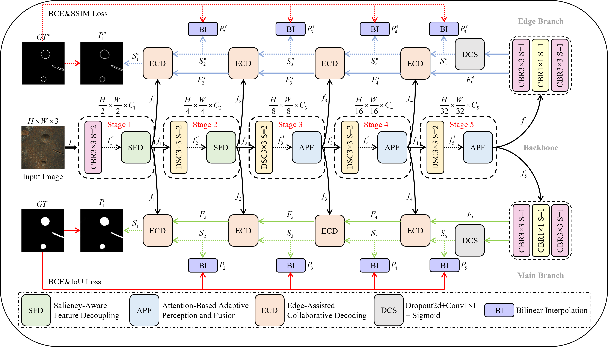

# 
`APFNet: A Lightweight Attention-Based Adaptive Perception and Fusion Network for No-Service Rail Surface Defect Segmentation`

      
    <em> 
    Framework of the proposed APFNet
    </em>

## License

Code in this repo is for non-commercial use only.
